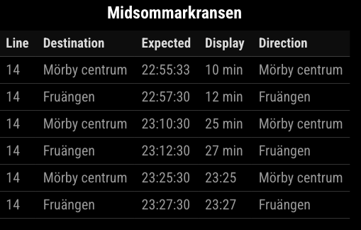

# MMM-SLMonitor

A MagicMirror² module that shows live metro departures using SL’s public transport API.

## Screenshot


##  Installation

```bash
cd ~/MagicMirror/modules
git clone git@github.com:isakhertin/MMM-SLMonitor.git
cd MMM-SLMonitor
npm install node-fetch@2
```

##  Configuration

Add the module to your `config.js`:

```js
{
  module: "MMM-SLMonitor",
  position: "top_center",
  config: {
    siteId: "9001", // SiteId, see Sites/SideID.md
    columns: ["line", "destination", "expected", "display",  "direction"], // columns that will be shown
    updateInterval: 30000, // in milliseconds
    maxRows: 10, // Number of rows in table
  }
}
```

## SL Site IDs (Examples)

| Station Name        | Site ID |
|---------------------|---------|
| Midsommarkransen    | 9264    |
| Slussen             | 9192    |
| T-Centralen         | 9001    |
| Fridhemsplan        | 9115    |
| Odenplan            | 1079    |
| Gullmarsplan        | 9189    |
| Skanstull           | 9190    |
| Zinkensdamm         | 9296    |
| Hornstull           | 9295    |
| Liljeholmen         | 9294    |
| Fruängen            | 9260    |
| Mörby Centrum       | 9200    |

You can find more site IDs by using SL’s API or network inspector on their real-time departure tools.

See full list of SiteID:s here:  [SiteID.md](Sites/SiteID.md)

##  Output Format

The module displays a table with the following columns:
- **Line** – Metro line number
- **Destination** – Where the train is going
- **Expected** – Expected departure time (e.g., `18:13:35`)
- **Direction** – Direction label from SL API

Made for Stockholm metro 
